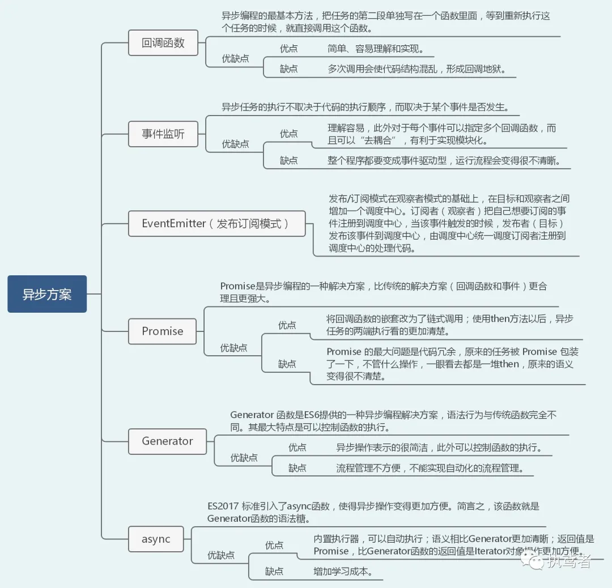

# 异步编程

## 异步的概念
异步（Asynchronous, async）是与同步（Synchronous, sync）相对的概念。同步就是在同一时间内，只有一个任务在执行，而异步就是在同一时间内，可以有多个任务在执行。

异步编程就是指，任务的执行不一定要按照顺序进行，而是可以交错进行，也就是说，异步编程就是一种事件驱动的编程模型。

## 异步编程的优点
1. 并发性：异步编程可以充分利用多核CPU的并发性，可以同时处理多个任务，提高程序的运行效率。
2. 响应性：异步编程可以提高程序的响应性，用户的操作可以不必等待程序处理完成，可以更快地得到结果反馈。
3. 健壮性：异步编程可以避免程序崩溃，可以保证程序的健壮性，即使遇到错误也可以继续运行。
4. 易于维护：异步编程可以提高代码的可维护性，因为异步编程模型更加简单，代码也更容易理解和维护。

## 异步演进史
异步编程的演进史可以分为三个阶段：
1. 回调函数：最早期的异步编程模型就是回调函数，回调函数就是将异步操作的结果作为参数传入到回调函数中，由回调函数来处理结果。
```
setTimeout(function () {
    document.getElementById("demo").innerHTML="RUNOOB!";
}, 3000);

```

2. Promise：Promise 是 ES6 引入的新概念，它是回调函数的升级版本，Promise 提供了链式调用的异步操作，使得异步操作更加方便。


3. Async/Await：Async/Await 是 ES7 引入的新概念，它是 Promise 的语法糖，使得异步操作更加简洁。

