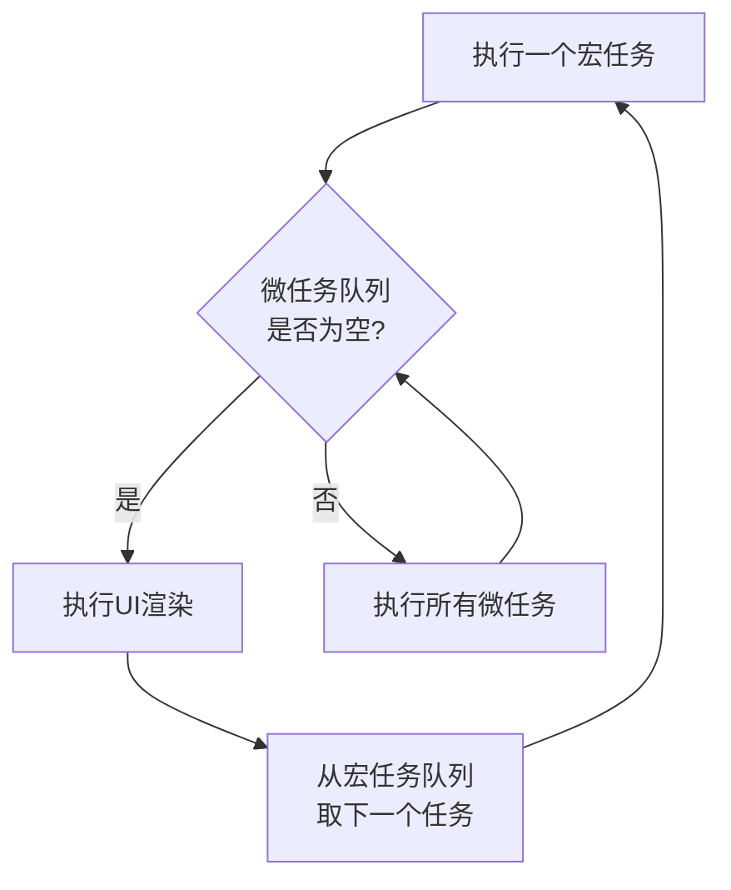
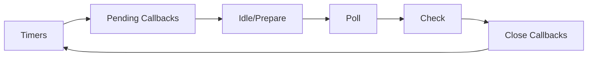

# JavaScript 宏任务与微任务详解

## 一、核心概念对比

| **特性**       | **宏任务 (Macrotask)**                  | **微任务 (Microtask)**                  |
|----------------|----------------------------------------|----------------------------------------|
| **触发源**     | 浏览器/Node.js 环境                    | JavaScript 引擎                       |
| **执行时机**   | 事件循环的主任务队列                   | 当前宏任务执行结束后立即执行           |
| **优先级**     | 低                                     | 高（在渲染前执行）                     |
| **典型示例**   | `setTimeout`, `setInterval`, I/O 操作 | `Promise.then`, `MutationObserver`    |
| **队列机制**   | 先进先出 (FIFO)                        | 先进先出 (FIFO)                        |
| **添加新任务** | 添加到宏任务队列                       | 添加到当前微任务队列                   |

在 JavaScript 的事件循环（Event Loop）机制中，异步任务被明确分为 宏任务（Macro Task） 和 微任务（Micro Task） 两类

## 二、事件循环 (Event Loop) 流程



### 执行顺序说明：
1. 从宏任务队列中取出**一个**任务执行
2. 执行**所有**微任务队列中的任务（直到队列清空）
3. 执行 UI 渲染（如果需要）
4. 返回步骤 1 开始下一轮循环

* 同步任务（Synchronous） → 微任务（MicroTask） → 宏任务（MacroTask）
* 微任务优先级高于宏任务（即每执行完一个宏任务，都会清空整个微任务队列）

## 三、常见任务分类

### 宏任务类型：
1. `<script>` 整体代码
2. `setTimeout()`, `setInterval()`
3. I/O 操作（文件读写、网络请求）
4. UI 渲染（浏览器）
5. 事件回调（如鼠标点击事件）
6. `setImmediate()`（Node.js 特有）

### 微任务类型：
1. `Promise.then()`, `.catch()`, `.finally()`
2. `queueMicrotask()` API
3. `MutationObserver`（浏览器 DOM 监听）
4. `process.nextTick()`（Node.js，**优先级最高**）

## 四、代码执行顺序分析

### 基础示例：
```javascript
console.log("同步任务1"); // 同步任务

setTimeout(() => {
  console.log("宏任务1 - setTimeout");
}, 0);

Promise.resolve().then(() => {
  console.log("微任务1 - Promise.then");
});

queueMicrotask(() => {
  console.log("微任务2 - queueMicrotask");
});

console.log("同步任务2"); // 同步任务
```
输出顺序：
```
同步任务1
同步任务2
微任务1 - Promise.then
微任务2 - queueMicrotask
宏任务1 - setTimeout
```

### 嵌套任务示例：
```javascript
console.log('Start'); // 同步任务 1

setTimeout(() => {
  console.log('Timeout 1'); // 宏任务 2
  Promise.resolve().then(() => console.log('Promise in Timeout')); // 微任务 3
}, 0);

Promise.resolve().then(() => {
  console.log('Promise 1'); // 微任务 2
  setTimeout(() => console.log('Timeout in Promise'), 0); // 宏任务 3
});

queueMicrotask(() => {
  console.log('Microtask'); // 微任务 2
});

console.log('End'); // 同步任务 1
```

**输出顺序**：
```
Start
End
Promise 1
Microtask
Timeout 1
Promise in Timeout
Timeout in Promise
```

## 五、Node.js 与浏览器差异

### Node.js 事件循环阶段：


### 特殊规则：
1. **`process.nextTick()`**：
   - 优先级高于其他微任务
   - 在当前阶段结束前立即执行

2. **`setImmediate()` vs `setTimeout()`**：
   - I/O 回调中：`setImmediate` 先于 `setTimeout` 执行
   - 非 I/O 环境：执行顺序不确定

```javascript
// Node.js 示例
setTimeout(() => console.log('setTimeout'), 0);
setImmediate(() => console.log('setImmediate'));
process.nextTick(() => console.log('nextTick'));
Promise.resolve().then(() => console.log('promise'));

// 输出顺序：
// nextTick
// promise
// setTimeout 或 setImmediate（顺序不确定）
```

## 六、实际应用场景

### 1. 性能优化
```javascript
// 分解长任务
function processLargeData(data) {
  // 先处理一部分
  const chunk = data.splice(0, 100);
  processChunk(chunk);
  
  if (data.length > 0) {
    // 使用微任务继续处理
    queueMicrotask(() => processLargeData(data));
  }
}
```

### 2. UI 更新优化
```javascript
// 在微任务中批量更新DOM
function updateUI(items) {
  const fragment = document.createDocumentFragment();
  
  items.forEach(item => {
    const element = createElement(item);
    fragment.appendChild(element);
  });
  
  // 在微任务中一次性插入
  Promise.resolve().then(() => {
    container.appendChild(fragment);
  });
}
```

### 3. 优先级控制
```javascript
// 确保高优先级任务先执行
function criticalTask() {
  // 高优先级操作
}

function normalTask() {
  // 普通操作
}

// 微任务中执行高优先级任务
Promise.resolve().then(criticalTask);

// 宏任务中执行普通任务
setTimeout(normalTask, 0);
```

## 七、常见问题与解决方案

### 1. 微任务嵌套过深
**问题**：微任务无限递归导致阻塞
```javascript
// 错误示例（导致死循环）
function recursiveMicrotask() {
  Promise.resolve().then(recursiveMicrotask);
}
```

**解决方案**：
```javascript
function safeRecursion(count = 0) {
  if (count > 1000) return;
  
  queueMicrotask(() => {
    // 处理任务
    safeRecursion(count + 1);
  });
}
```

### 2. 任务饥饿
**问题**：微任务不断产生新微任务，阻塞宏任务执行
```javascript
function microtaskStorm() {
  Promise.resolve().then(microtaskStorm);
}
```

**解决方案**：合理分配任务类型
```javascript
function balancedProcessing() {
  // 处理一部分
  processBatch();
  
  // 剩余任务放入宏任务
  if (hasMore) {
    setTimeout(balancedProcessing, 0);
  }
}
```

### 3. 跨平台行为差异
**解决方案**：封装统一接口
```javascript
const nextTask = typeof queueMicrotask === 'function' 
  ? queueMicrotask 
  : typeof process === 'object' 
    ? process.nextTick 
    : callback => Promise.resolve().then(callback);
    
// 使用
nextTask(() => {
  console.log('统一任务执行');
});
```

## 八、最佳实践指南

1. **优先使用微任务**：
   - DOM 更新后处理
   - 状态同步
   - 高优先级任务

2. **合理使用宏任务**：
   - I/O 操作
   - 长时间运行的任务
   - 用户交互响应

3. **避免**：
   - 微任务中执行耗时操作
   - 无限递归任务
   - 混用平台特有 API 而不处理差异

4. **调试技巧**：
   ```javascript
   // 监控任务执行时间
   function monitorTask(fn) {
     const start = performance.now();
     fn();
     const duration = performance.now() - start;
     if (duration > 50) {
       console.warn('长任务警告:', duration);
     }
   }
   ```

## 九、现代 API 应用

### 1. `queueMicrotask`
```javascript
// 标准微任务API
queueMicrotask(() => {
  console.log('安全添加微任务');
});
```

### 2. `AbortController`
```javascript
// 取消长时间任务
const controller = new AbortController();

queueMicrotask(() => {
  if (controller.signal.aborted) return;
  // 执行任务
});

// 需要时取消
controller.abort();
```

### 3. `Scheduler.postTask`
```javascript
// 实验性API（Chrome 94+）
scheduler.postTask(() => {
  console.log('高优先级任务');
}, { priority: 'user-blocking' });
```

## 总结与关键点

1. **执行顺序铁律**：
   ```
   宏任务 → 所有微任务 → 渲染 → 下一个宏任务
   ```

2. **优先级规则**：
   ```
   process.nextTick > Promise.then > setTimeout > setImmediate
   ```

3. **核心区别**：
   - 微任务：**同一轮循环**内执行
   - 宏任务：**下一轮循环**执行

4. **设计原则**：
   - 微任务用于**即时反馈**（Promise 结果）
   - 宏任务用于**分散工作**（I/O、渲染）

理解宏任务与微任务的机制是掌握 JavaScript 异步编程的核心，合理利用两种任务类型可以显著提升应用性能和用户体验。