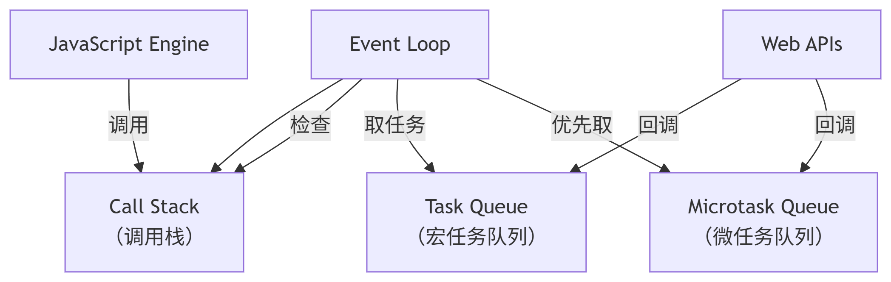

JavaScript 的执行机制核心是 **单线程 + 事件循环（Event Loop）**，其设计目标是在避免阻塞的同时高效处理异步操作。以下是深度解析：

---

### 一、核心架构：运行时环境组成



1. **调用栈（Call Stack）**  
   - 同步代码的执行位置（LIFO：后进先出）
   - **阻塞规则**：栈不为空时，主线程被占用

2. **宿主环境（Web APIs / Node.js C++ APIs）**  
   - 提供异步能力（如 `setTimeout`, `fetch`, `fs.readFile`）
   - **关键行为**：异步操作完成时，将回调推入对应队列

3. **任务队列（Queues）**  
   - **宏任务队列（Task Queue）**：存放 `setTimeout`、DOM 事件等回调
   - **微任务队列（Microtask Queue）**：存放 `Promise.then`、`MutationObserver` 回调

4. **事件循环（Event Loop）**  
   - 持续循环执行以下步骤：
     ```javascript
     while (true) {
       // 1. 执行调用栈中的同步代码（直到栈空）
       // 2. 清空微任务队列（全部执行！）
       // 3. 如有需要 → 渲染页面（浏览器）
       // 4. 从宏任务队列取一个任务执行
     }
     ```

---

### 二、执行顺序的黄金法则
1. **同步代码** → **所有微任务** → **一个宏任务** → **所有微任务** → **渲染（如需要）** → 重复  
   ```javascript
   console.log("同步1"); // 同步

   setTimeout(() => console.log("宏任务1"), 0); // 宏任务

   Promise.resolve()
     .then(() => console.log("微任务1")); // 微任务

   console.log("同步2"); // 同步

   // 输出顺序：
   // 同步1 → 同步2 → 微任务1 → 宏任务1
   ```

2. **微任务优先级陷阱**  
   微任务执行中产生的**新微任务**会继续执行，直到队列清空：
   ```javascript
   Promise.resolve()
     .then(() => {
       console.log("微任务1");
       Promise.resolve().then(() => console.log("嵌套微任务"));
     })
     .then(() => console.log("微任务2"));

   // 输出顺序：
   // 微任务1 → 嵌套微任务 → 微任务2
   ```

---

### 三、关键场景解析
#### 场景 1：同步 + 宏任务 + 微任务
```javascript
console.log("脚本开始"); // 同步

setTimeout(() => {
  console.log("setTimeout"); // 宏任务
  Promise.resolve().then(() => console.log("setTimeout 中的微任务")); // 微任务
}, 0);

Promise.resolve()
  .then(() => console.log("Promise 微任务1")) // 微任务
  .then(() => console.log("Promise 微任务2")); // 微任务

console.log("脚本结束"); // 同步
```
**执行流程**：
1. 同步代码：`脚本开始` → `脚本结束`
2. 清空微任务队列：`Promise 微任务1` → `Promise 微任务2`
3. 执行一个宏任务：`setTimeout`
4. 执行宏任务中的微任务：`setTimeout 中的微任务`

**输出**：
```
脚本开始
脚本结束
Promise 微任务1
Promise 微任务2
setTimeout
setTimeout 中的微任务
```

#### 场景 2：UI 渲染的时机
```javascript
document.body.style.backgroundColor = "red"; // 同步

setTimeout(() => {
  document.body.style.backgroundColor = "blue"; // 宏任务
}, 0);

Promise.resolve().then(() => {
  document.body.style.backgroundColor = "yellow"; // 微任务
});
```
**渲染结果**：
1. 先变红（同步）
2. **微任务优先**：变黄（覆盖红色）
3. 最后变蓝（宏任务）

> **重要规则**：页面渲染发生在 **微任务执行后、下一个宏任务执行前**

---

### 四、浏览器 vs Node.js 差异
| **特性**         | **浏览器**                     | **Node.js**                     |
|------------------|-------------------------------|--------------------------------|
| **宏任务类型**   | `setTimeout`, DOM 事件, `requestAnimationFrame` | `setTimeout`, `setImmediate`, I/O |
| **微任务优先级** | `Promise` > `MutationObserver` | `process.nextTick` > `Promise` |
| **事件循环阶段** | 简化模型                      | 6 个复杂阶段（Timers, I/O 等）  |

**Node.js 特殊示例**：
```javascript
setTimeout(() => console.log("setTimeout"), 0);
setImmediate(() => console.log("setImmediate"));
```
输出顺序不确定！因为受事件循环启动时间影响。

---

### 五、开发者必须掌握的要点
1. **避免阻塞主线程**  
   - 超过 50ms 的任务需拆分为宏任务（如用 `setTimeout` 分片）

2. **警惕微任务递归**  
   ```javascript
   function microtaskLoop() {
     Promise.resolve().then(microtaskLoop); // 导致事件循环卡死！
   }
   microtaskLoop();
   ```

3. **优先使用微任务更新状态**  
   ```javascript
   // 正确：在微任务中更新 UI 相关状态
   button.addEventListener("click", () => {
     Promise.resolve().then(updateDOM);
   });
   ```

> **终极口诀**：  
> **同步代码立即行，微任务清空再渲染，一个宏任务走一轮，循环往复永不停。**  

理解此机制，可彻底解决 JavaScript 异步顺序问题！