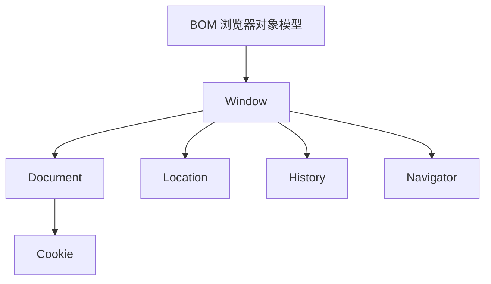

# JavaScript Cookie：深入解析与全面指南

## 一、Cookie 的本质与归属

**JavaScript Cookie 属于 BOM（浏览器对象模型）的一部分**，具体来说它是 `document` 对象的一个属性。Cookie 是浏览器存储机制的核心组件，用于在客户端存储小型数据（通常小于 4KB）。

### Cookie 在 BOM 中的位置：


## 二、Cookie 的核心特性

| 特性 | 描述 | 说明 |
|------|------|------|
| **存储大小** | 4KB 左右 | 不同浏览器有微小差异 |
| **域名绑定** | 与创建它的域名关联 | 不能跨域访问 |
| **自动发送** | 随每个 HTTP 请求发送 | 增加请求负载 |
| **生命周期** | 可设置过期时间 | 会话级或持久化 |
| **安全限制** | 遵循同源策略 | 可配置安全选项 |

## 三、Cookie 操作 API

### 1. 读取所有 Cookie
```javascript
const allCookies = document.cookie; 
// 返回字符串格式："name=value; name2=value2"
```

### 2. 设置 Cookie
```javascript
function setCookie(name, value, days = 7, path = '/') {
  const date = new Date();
  date.setTime(date.getTime() + (days * 24 * 60 * 60 * 1000));
  const expires = `expires=${date.toUTCString()}`;
  
  document.cookie = `${name}=${encodeURIComponent(value)}; ${expires}; path=${path}`;
}

// 使用示例
setCookie('theme', 'dark', 30);
```

### 3. 获取特定 Cookie
```javascript
function getCookie(name) {
  const cookies = document.cookie.split(';');
  for (const cookie of cookies) {
    const [cookieName, cookieValue] = cookie.trim().split('=');
    if (cookieName === name) {
      return decodeURIComponent(cookieValue);
    }
  }
  return null;
}

// 使用示例
const theme = getCookie('theme'); // "dark"
```

### 4. 删除 Cookie
```javascript
function deleteCookie(name, path = '/') {
  document.cookie = `${name}=; expires=Thu, 01 Jan 1970 00:00:00 UTC; path=${path}`;
}

// 使用示例
deleteCookie('theme');
```

## 四、Cookie 属性详解

### 1. 基础属性
```javascript
document.cookie = "user=John; path=/; domain=.example.com; max-age=3600; secure; samesite=lax";
```

| 属性 | 描述 | 示例 |
|------|------|------|
| **path** | 有效路径 | `path=/products` |
| **domain** | 有效域名 | `domain=.example.com` |
| **max-age** | 有效期（秒） | `max-age=2592000` (30天) |
| **expires** | 过期时间 | `expires=Fri, 31 Dec 2023 23:59:59 GMT` |
| **secure** | 仅 HTTPS 传输 | `secure` |
| **samesite** | 跨站策略 | `samesite=strict`, `lax`, `none` |

### 2. SameSite 策略
| 值 | 描述 | 使用场景 |
|----|------|----------|
| **Strict** | 完全禁止跨站发送 | 银行操作等高安全场景 |
| **Lax** | 允许部分导航请求发送 | 默认推荐值 |
| **None** | 允许跨站发送 | 需要配合 Secure 属性 |

## 五、Cookie 与现代存储方案对比

| 特性 | Cookie | localStorage | sessionStorage | IndexedDB |
|------|--------|--------------|----------------|-----------|
| **容量** | 4KB | 5-10MB | 5-10MB | 50%硬盘 |
| **生命周期** | 可设置 | 永久 | 会话结束 | 永久 |
| **自动发送** | ✓ | ✗ | ✗ | ✗ |
| **同源策略** | ✓ | ✓ | ✓ | ✓ |
| **访问方式** | 文档对象 | 存储对象 | 存储对象 | 数据库 |
| **适用场景** | 身份认证 | 本地缓存 | 会话存储 | 复杂数据 |

## 六、实际应用场景

### 1. 用户身份认证
```javascript
// 登录成功后设置认证Cookie
function handleLogin(user) {
  const token = generateAuthToken(user);
  setCookie('auth_token', token, 1); // 1天有效期
  
  // 安全设置
  document.cookie = `auth_token=${token}; max-age=86400; path=/; secure; samesite=strict`;
}
```

### 2. 用户偏好设置
```javascript
// 保存主题偏好
function saveThemePreference(theme) {
  setCookie('theme', theme, 365); // 保存1年
  
  // 应用主题
  document.documentElement.setAttribute('data-theme', theme);
}

// 初始化检查
window.addEventListener('DOMContentLoaded', () => {
  const theme = getCookie('theme') || 'light';
  document.documentElement.setAttribute('data-theme', theme);
});
```

### 3. 购物车持久化
```javascript
function saveCart(cartItems) {
  const cartData = JSON.stringify(cartItems);
  setCookie('shopping_cart', cartData, 7); // 保存7天
}

function loadCart() {
  const cartData = getCookie('shopping_cart');
  return cartData ? JSON.parse(cartData) : [];
}
```

## 七、安全最佳实践

### 1. 安全防护措施
```javascript
// 安全设置Cookie
document.cookie = `${name}=${value}; secure; httponly; samesite=lax; path=/`;
```

| 属性 | 安全作用 | 必要性 |
|------|----------|--------|
| **Secure** | 仅 HTTPS 传输 | 生产环境必须 |
| **HttpOnly** | 禁止 JavaScript 访问 | 敏感Cookie必须 |
| **SameSite=Lax** | 限制跨站请求 | 防止CSRF攻击 |
| **Path** | 限制访问路径 | 推荐设置 |
| **Domain** | 限制访问域名 | 精确设置 |

### 2. 敏感数据处理
```javascript
// 避免存储敏感信息
// 错误做法 ❌
setCookie('credit_card', '1234-5678-9012-3456');

// 正确做法 ✅
// 服务端返回安全令牌
fetch('/login', { method: 'POST', body: credentials })
  .then(res => res.json())
  .then(data => {
    setCookie('session_id', data.token);
  });
```

### 3. Cookie 安全扫描
```javascript
// 检查当前页面的Cookie安全配置
function checkCookieSecurity() {
  const cookies = document.cookie.split(';');
  
  cookies.forEach(cookie => {
    const [name] = cookie.trim().split('=');
    
    if (!document.cookie.includes(`${name}; secure`)) {
      console.warn(`Cookie ${name} 未设置Secure标记`);
    }
    
    if (!document.cookie.includes(`${name}; httponly`)) {
      console.warn(`Cookie ${name} 未设置HttpOnly标记`);
    }
  });
}
```

## 八、现代替代方案

### 1. Web Storage API
```javascript
// localStorage - 长期存储
localStorage.setItem('theme', 'dark');
const theme = localStorage.getItem('theme');

// sessionStorage - 会话存储
sessionStorage.setItem('cart', JSON.stringify(cartItems));
```

### 2. HTTP Only Cookie + JWT
```http
# HTTP响应头设置安全Cookie
Set-Cookie: auth_token=eyJhbG...; Max-Age=86400; Path=/; Secure; HttpOnly; SameSite=Lax
```

### 3. 服务端会话管理
```javascript
// 使用express-session (Node.js)
app.use(session({
  secret: 'your_secret',
  resave: false,
  saveUninitialized: true,
  cookie: { 
    secure: true,
    httpOnly: true,
    maxAge: 24 * 60 * 60 * 1000 // 1天
  }
}));
```

## 九、Cookie 的未来发展

### 1. Cookie 的局限性解决方案
| 问题 | 解决方案 |
|------|----------|
| 大小限制 | IndexedDB、Web SQL |
| 自动发送 | Authorization 头部 |
| 安全风险 | SameSite 策略、Cookie Prefixes |
| 隐私问题 | GDPR、CCPA 合规 |

### 2. 新兴标准
- **Cookie Store API**：更现代的Cookie操作接口
  ```javascript
  // 实验性API（Chrome 87+）
  cookieStore.set('theme', 'dark', { 
    expires: Date.now() + 86400000,
    domain: 'example.com'
  });
  
  cookieStore.get('theme').then(cookie => {
    console.log(cookie.value);
  });
  ```

- **Partitioned Cookies**：解决第三方Cookie隐私问题
  ```http
  Set-Cookie: __Host-partitioned=value; Secure; Path=/; Partitioned;
  ```

## 总结：Cookie 的本质与定位

1. **技术归属**：JavaScript Cookie 是 **BOM 的一部分**，通过 `document.cookie` 访问
   
2. **核心价值**：
   - 客户端小型数据存储
   - 维持 HTTP 状态（解决无状态问题）
   - 用户认证和会话管理

3. **现代定位**：
   ```mermaid
   graph LR
     A[客户端存储] --> B[敏感认证信息]
     A --> C[用户偏好设置]
     A --> D[临时状态保持]
     E[替代方案] --> F[localStorage]
     E --> G[sessionStorage]
     E --> H[IndexedDB]
   ```

4. **最佳实践**：
   - 优先使用 HttpOnly + Secure Cookie 存储认证令牌
   - 避免在 Cookie 中存储敏感数据
   - 为关键 Cookie 设置 SameSite 策略
   - 考虑使用现代存储方案替代非认证用途的 Cookie

虽然现代 Web 开发中出现了许多新的存储方案，但 Cookie 在用户认证和会话管理方面仍然不可替代，特别是在需要与服务器自动通信的场景中。理解 Cookie 的工作原理和安全实践对于构建健壮的 Web 应用至关重要。