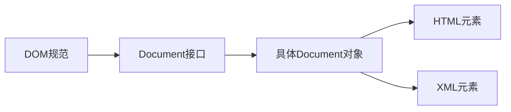
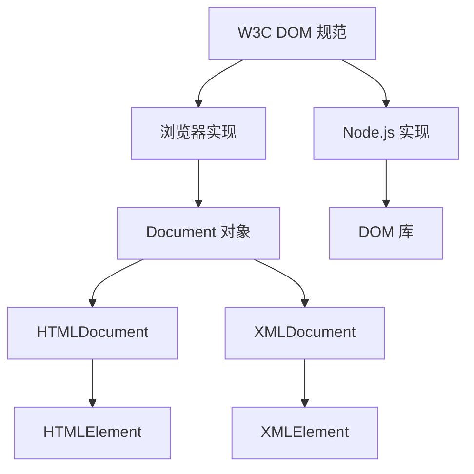

# Document 对象

# JavaScript BOM `document` 对象详解

`document` 对象是浏览器对象模型（BOM）的核心组件，也是文档对象模型（DOM）的入口点。它代表了当前浏览器窗口或标签页中加载的整个HTML文档，提供了访问和操作页面内容的能力。

## 一、document 对象核心属性

### 1. 文档信息属性
| 属性 | 描述 | 示例 |
|------|------|------|
| **`document.URL`** | 完整文档URL | `"https://example.com/path?query=1"` |
| **`document.documentURI`** | 文档URI（同URL） | `"https://example.com/path"` |
| **`document.domain`** | 文档域名 | `"example.com"` |
| **`document.referrer`** | 来源页面URL | `"https://google.com"` |
| **`document.title`** | 文档标题 | `"My Page"` |
| **`document.characterSet`** | 文档字符编码 | `"UTF-8"` |
| **`document.contentType`** | 文档内容类型 | `"text/html"` |
| **`document.readyState`** | 文档加载状态 | `"loading"`, `"interactive"`, `"complete"` |

### 2. 文档结构属性
| 属性 | 描述 | 示例 |
|------|------|------|
| **`document.doctype`** | 文档类型声明 | `<!DOCTYPE html>` |
| **`document.documentElement`** | `<html>`元素 | `<html>...</html>` |
| **`document.head`** | `<head>`元素 | `<head>...</head>` |
| **`document.body`** | `<body>`元素 | `<body>...</body>` |
| **`document.forms`** | 所有表单集合 | `HTMLCollection [form1, form2]` |
| **`document.images`** | 所有图像集合 | `HTMLCollection [img1, img2]` |
| **`document.links`** | 所有链接集合 | `HTMLCollection [a1, a2]` |
| **`document.scripts`** | 所有脚本集合 | `HTMLCollection [script1, script2]` |

## 二、文档操作方法

### 1. 元素选择方法
| 方法 | 描述 | 返回 |
|------|------|------|
| **`getElementById(id)`** | 通过ID获取元素 | 单个元素 |
| **`getElementsByClassName(names)`** | 通过类名获取元素 | HTMLCollection |
| **`getElementsByTagName(tagName)`** | 通过标签名获取元素 | HTMLCollection |
| **`getElementsByName(name)`** | 通过name属性获取元素 | NodeList |
| **`querySelector(selector)`** | CSS选择器获取首个匹配元素 | 单个元素 |
| **`querySelectorAll(selector)`** | CSS选择器获取所有匹配元素 | NodeList |

### 2. 节点操作方法
| 方法 | 描述 | 示例 |
|------|------|------|
| **`createElement(tagName)`** | 创建新元素 | `document.createElement('div')` |
| **`createTextNode(text)`** | 创建文本节点 | `document.createTextNode('Hello')` |
| **`createDocumentFragment()`** | 创建文档片段 | `const frag = document.createDocumentFragment()` |
| **`createAttribute(name)`** | 创建属性节点 | `const attr = document.createAttribute('data-id')` |
| **`importNode(node, deep)`** | 导入外部节点 | `document.importNode(externalNode, true)` |
| **`adoptNode(node)`** | 从外部文档采用节点 | `document.adoptNode(externalNode)` |

### 3. 文档操作高级方法
| 方法 | 描述 | 示例 |
|------|------|------|
| **`write(text)`** | 向文档写入内容 | `document.write('<h1>Hello</h1>')` |
| **`writeln(text)`** | 写入内容并换行 | `document.writeln('Line 1')` |
| **`open()`** | 打开文档流 | `document.open()` |
| **`close()`** | 关闭文档流 | `document.close()` |
| **`execCommand(command)`** | 执行编辑命令 | `document.execCommand('bold')` |
| **`hasFocus()`** | 检查文档是否聚焦 | `if (document.hasFocus()) {...}` |

## 三、DOM 操作实践

### 1. 元素创建与插入
```javascript
// 创建新元素
const newDiv = document.createElement('div');
newDiv.className = 'alert';
newDiv.textContent = 'Hello World!';

// 插入到文档中
document.body.appendChild(newDiv);

// 插入到特定位置
const referenceElement = document.getElementById('target');
document.body.insertBefore(newDiv, referenceElement);

// 使用文档片段优化多次插入
const fragment = document.createDocumentFragment();
for (let i = 0; i < 100; i++) {
  const item = document.createElement('li');
  item.textContent = `Item ${i}`;
  fragment.appendChild(item);
}
document.getElementById('list').appendChild(fragment);
```

### 2. 样式与类操作
```javascript
// 添加/移除类
element.classList.add('active');
element.classList.remove('inactive');
element.classList.toggle('highlight');

// 修改内联样式
element.style.backgroundColor = 'blue';
element.style.setProperty('--theme-color', '#ff0000');

// 获取计算样式
const computedStyle = window.getComputedStyle(element);
console.log(computedStyle.getPropertyValue('font-size'));
```

### 3. 属性操作
```javascript
// 标准属性
element.id = 'new-id';
element.setAttribute('data-custom', 'value');

// 自定义数据属性
element.dataset.userId = '12345';
console.log(element.dataset.userId); // "12345"

// 获取所有属性
const attributes = element.attributes;
for (let attr of attributes) {
  console.log(`${attr.name} = ${attr.value}`);
}
```

## 四、事件处理机制

### 1. 事件监听
```javascript
// 标准事件监听
element.addEventListener('click', function(event) {
  console.log('Clicked!', event.target);
});

// 事件委托
document.body.addEventListener('click', function(event) {
  if (event.target.matches('.delete-btn')) {
    deleteItem(event.target.dataset.id);
  }
});
```

### 2. 自定义事件
```javascript
// 创建自定义事件
const event = new CustomEvent('itemAdded', {
  detail: { id: 42, name: 'New Item' },
  bubbles: true,
  cancelable: true
});

// 触发事件
document.dispatchEvent(event);

// 监听自定义事件
document.addEventListener('itemAdded', e => {
  console.log('Item added:', e.detail);
});
```

## 五、文档生命周期管理

### 1. 加载状态处理
```javascript
// DOMContentLoaded - DOM已加载完成
document.addEventListener('DOMContentLoaded', () => {
  initApp();
});

// load - 所有资源加载完成
window.addEventListener('load', () => {
  trackPageLoad();
});

// beforeunload - 页面卸载前
window.addEventListener('beforeunload', (event) => {
  if (hasUnsavedChanges) {
    event.preventDefault();
    event.returnValue = '';
    return '您有未保存的更改，确定离开吗？';
  }
});

// 检查当前状态
if (document.readyState === 'complete') {
  runAfterLoad();
}
```

### 2. 动态资源加载
```javascript
// 动态加载CSS
const loadCSS = url => {
  const link = document.createElement('link');
  link.rel = 'stylesheet';
  link.href = url;
  document.head.appendChild(link);
};

// 动态加载JS
const loadJS = (url, callback) => {
  const script = document.createElement('script');
  script.src = url;
  script.onload = callback;
  document.body.appendChild(script);
};
```

## 六、现代 DOM API

### 1. Element 扩展方法
```javascript
// 元素位置信息
const rect = element.getBoundingClientRect();
console.log(rect.width, rect.height);

// 检查元素可见性
const isVisible = element.checkVisibility({
  checkOpacity: true,
  checkVisibilityCSS: true
});

// 滚动元素进入视图
element.scrollIntoView({
  behavior: 'smooth',
  block: 'center'
});
```

### 2. MutationObserver
```javascript
// 监听DOM变化
const observer = new MutationObserver(mutations => {
  mutations.forEach(mutation => {
    if (mutation.type === 'childList') {
      console.log('子节点变化');
    }
  });
});

observer.observe(document.body, {
  childList: true,
  subtree: true,
  attributes: true,
  characterData: true
});
```

### 3. IntersectionObserver
```javascript
// 监听元素进入视口
const io = new IntersectionObserver(entries => {
  entries.forEach(entry => {
    if (entry.isIntersecting) {
      console.log('元素进入视口');
      io.unobserve(entry.target);
    }
  });
}, { threshold: 0.5 });

document.querySelectorAll('.lazy-load').forEach(el => {
  io.observe(el);
});
```

## 七、安全最佳实践

### 1. 防止 XSS 攻击
```javascript
// 安全设置内容
element.textContent = userInput; // 安全
element.innerHTML = userInput; // 危险

// 安全HTML插入
function safeHTML(str) {
  const div = document.createElement('div');
  div.textContent = str;
  return div.innerHTML;
}

// 使用Content Security Policy (CSP)
// HTTP Header: Content-Security-Policy: default-src 'self'
```

### 2. 安全性能优化
```javascript
// 事件委托减少监听器数量
document.addEventListener('click', event => {
  if (event.target.closest('.btn')) {
    handleButtonClick(event);
  }
});

// 使用事件捕获提高性能
document.addEventListener('click', handler, true);

// 优化选择器性能
// 不好: document.querySelectorAll('div .item .name')
// 更好: document.getElementById('container').querySelectorAll('.name')
```

## 八、特殊文档类型处理

### 1. XML 文档处理
```javascript
const parser = new DOMParser();
const xmlDoc = parser.parseFromString(xmlString, "text/xml");
const nodes = xmlDoc.querySelectorAll('book');

// 创建XML文档
const serializer = new XMLSerializer();
const xmlString = serializer.serializeToString(xmlDoc);
```

### 2. SVG 文档操作
```javascript
const svgNS = "http://www.w3.org/2000/svg";
const circle = document.createElementNS(svgNS, "circle");
circle.setAttribute("cx", "50");
circle.setAttribute("cy", "50");
circle.setAttribute("r", "40");
document.getElementById("svg-container").appendChild(circle);
```

## 九、实际应用场景

### 1. 单页面应用路由
```javascript
// 基础路由实现
const routes = {
  '/': homeView,
  '/about': aboutView,
  '/contact': contactView
};

function navigate(path) {
  // 清除当前内容
  document.getElementById('app').innerHTML = '';
  
  // 渲染新视图
  const view = routes[path] || notFoundView;
  view();
  
  // 更新URL
  history.pushState({}, '', path);
}

// 初始化路由
window.addEventListener('popstate', () => {
  navigate(window.location.pathname);
});
navigate(window.location.pathname);
```

### 2. 表单动态验证
```javascript
const form = document.getElementById('signup-form');

form.addEventListener('input', event => {
  const input = event.target;
  
  if (input.validity.valid) {
    input.classList.remove('invalid');
    input.nextElementSibling.textContent = '';
  } else {
    showValidationError(input);
  }
});

function showValidationError(input) {
  input.classList.add('invalid');
  
  let message = '';
  if (input.validity.valueMissing) {
    message = '此字段为必填项';
  } else if (input.validity.typeMismatch) {
    message = '请输入有效的邮箱地址';
  } else if (input.validity.tooShort) {
    message = `密码至少需要 ${input.minLength} 个字符`;
  }
  
  input.nextElementSibling.textContent = message;
}
```

### 3. 拖放文件上传
```javascript
const dropArea = document.getElementById('drop-area');

['dragenter', 'dragover', 'dragleave', 'drop'].forEach(eventName => {
  dropArea.addEventListener(eventName, preventDefaults);
});

function preventDefaults(e) {
  e.preventDefault();
  e.stopPropagation();
}

['dragenter', 'dragover'].forEach(eventName => {
  dropArea.addEventListener(eventName, highlight);
});

['dragleave', 'drop'].forEach(eventName => {
  dropArea.addEventListener(eventName, unhighlight);
});

function highlight() {
  dropArea.classList.add('highlight');
}

function unhighlight() {
  dropArea.classList.remove('highlight');
}

dropArea.addEventListener('drop', handleDrop);

function handleDrop(e) {
  const dt = e.dataTransfer;
  const files = dt.files;
  
  handleFiles(files);
}

function handleFiles(files) {
  ([...files]).forEach(uploadFile);
}

function uploadFile(file) {
  const formData = new FormData();
  formData.append('file', file);
  
  fetch('/upload', {
    method: 'POST',
    body: formData
  });
}
```

## 总结

`document` 对象是Web开发的核心接口，提供了：
- **文档访问**：获取页面元素、结构和内容
- **内容操作**：动态创建、修改和删除DOM节点
- **事件处理**：响应用户交互和文档变化
- **生命周期管理**：控制文档加载和卸载过程

**最佳实践建议**：
1. 优先使用现代API（`querySelector`、`classList`等）
2. 优化DOM操作性能（使用文档片段、事件委托）
3. 实施严格的安全措施（防止XSS攻击）
4. 遵循可访问性标准（语义化HTML、ARIA属性）
5. 分离逻辑与表现（避免内联事件和样式）

掌握 `document` 对象的使用是创建动态、交互式Web应用的基石，从简单的页面操作到复杂的单页面应用都离不开它的强大功能。


# Document 与 DOM 的区别详解

## 核心概念区别

| 特性 | Document | DOM |
|------|----------|-----|
| **定义** | 表示**特定文档**的对象（如HTML文档） | 表示**文档结构**的编程接口 |
| **本质** | 具体实现对象 | 抽象模型规范 |
| **范围** | 单个文档实例 | 整个文档模型概念 |
| **角色** | DOM树的**入口点** | 文档的**结构化表示** |
| **关系** | DOM的**具体实现** | Document的**理论基础** |



## 深入解析区别

### 1. DOM (Document Object Model)
- **抽象模型**：文档结构的对象表示规范
- **跨平台标准**：由W3C制定的独立于语言和平台的接口
- **树状结构**：将文档表示为节点树（元素、属性、文本等）
- **操作接口**：提供访问和修改文档内容的方法
- **多类型支持**：适用于HTML和XML文档

### 2. Document 对象
- **具体实现**：浏览器中DOM规范的具体表现
- **入口点**：访问整个文档的起点
- **属性和方法**：提供文档级操作（如`getElementById`）
- **环境特定**：浏览器环境中通过`window.document`访问
- **文档表示**：特定加载的HTML/XML文档实例

## 关键差异对比

### 1. 抽象层级
```javascript
// DOM是概念层
class DOMNode {
  // 定义节点通用接口
}

// Document是具体实现层
class HTMLDocument extends DOMNode {
  // 浏览器具体实现
  getElementById() { /*...*/ }
}
```

### 2. 包含关系
```javascript
// DOM包含Document
DOM = {
  Document: {
    HTMLDocument: class { /*...*/ },
    XMLDocument: class { /*...*/ }
  },
  Element: { /*...*/ },
  Text: { /*...*/ }
}

// Document包含DOM元素
document = {
  documentElement: html,
  head: head,
  body: body,
  // ...其他元素
}
```

### 3. 功能范围
| 功能 | DOM支持 | Document支持 |
|------|---------|--------------|
| 节点创建 | ✅ | ✅ |
| 树结构遍历 | ✅ | ✅ |
| 文档级元数据访问 | ❌ | ✅ |
| 浏览器特定功能 | ❌ | ✅ |
| XML/HTML通用操作 | ✅ | ❌（需特定Document类型） |

## 实际关系演示

### 1. Document 作为 DOM 入口
```javascript
// 通过document访问DOM
const element = document.getElementById('content');

// 等价于DOM操作
const elementInDOM = document.documentElement
  .querySelector('#content');
```

### 2. DOM 操作 vs Document 方法
```javascript
// 纯DOM操作（跨平台）
function createElementDOM(tag) {
  return document.implementation.createDocument(
    'http://www.w3.org/1999/xhtml', 
    tag, 
    null
  ).documentElement;
}

// Document特定方法（浏览器优化）
function createElementDoc(tag) {
  return document.createElement(tag);
}
```

## 应用场景区别

### 1. Document 适用场景
- 访问文档元信息（标题、URL）
- 文档级操作（`write`, `open`, `close`）
- 获取特定元素（`body`, `head`）
- 浏览器环境特定功能

### 2. 纯 DOM 适用场景
- XML文档处理
- 非浏览器环境（Node.js）
- 通用文档操作库开发
- 跨平台文档处理

## 技术实现关系



## 代码示例：Document vs DOM

### 1. 创建元素对比
```javascript
// 使用Document方法（浏览器特定）
const div = document.createElement('div');
div.textContent = 'Document创建的div';
document.body.appendChild(div);

// 使用纯DOM方法（跨平台）
const doc = document.implementation.createHTMLDocument('New Document');
const domDiv = doc.createElement('div');
domDiv.textContent = 'DOM创建的div';
doc.body.appendChild(domDiv);

// 导入到当前文档
const importedDiv = document.importNode(domDiv, true);
document.body.appendChild(importedDiv);
```

### 2. 文档操作对比
```javascript
// Document特有方法
document.title = '新标题'; // 设置文档标题
document.cookie = 'user=John'; // 操作cookie

// 通用DOM方法
const titleElement = document.querySelector('title');
titleElement.textContent = '新标题'; // 通过DOM操作
```

## 特殊文档类型处理

### XML文档处理（纯DOM）
```javascript
const parser = new DOMParser();
const xmlString = `
  <catalog>
    <book id="bk101">
      <title>XML Programming</title>
    </book>
  </catalog>
`;

// 创建XML Document（不是HTML Document）
const xmlDoc = parser.parseFromString(xmlString, "text/xml");

// 使用通用DOM方法访问
const book = xmlDoc.querySelector('book');
console.log(book.getAttribute('id')); // "bk101"
```

## 总结：核心区别要点

1. **抽象 vs 具体**：
   - DOM是**抽象规范**
   - Document是**具体实现**

2. **范围差异**：
   - DOM描述**整个文档模型**
   - Document表示**单个文档实例**

3. **功能侧重**：
   - DOM提供**通用接口**
   - Document提供**浏览器特定功能**

4. **使用场景**：
   - DOM适用于**跨平台文档处理**
   - Document适用于**浏览器环境操作**

5. **包含关系**：
   ```mermaid
   graph LR
       DOM --> Document
       Document --> HTMLElements
       Document --> XMLDocuments
   ```

在Web开发中，我们通常通过Document对象访问和操作DOM，因为Document提供了浏览器优化过的API和与当前文档相关的特定功能。理解这两者的区别有助于在不同场景选择正确的操作方式。