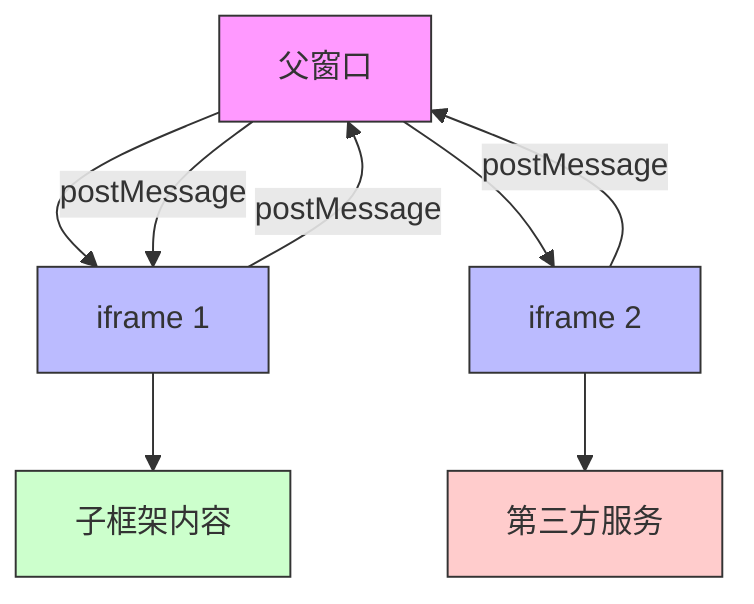

# Fames 对象 (已弃用)

## 一、`frames` 对象概述

`frames` 是浏览器对象模型 (BOM) 的重要组成部分，它提供了对当前窗口或框架集中所有框架（`<frame>` 或 `<iframe>`）的访问能力。在现代 Web 开发中，`<frame>` 元素已被废弃，而 `<iframe>` 元素则被广泛使用。

### 核心特性
- **框架集合**：`window.frames` 返回当前窗口中的所有子框架
- **多窗口管理**：每个框架都有自己的 `window` 对象和 `document` 对象
- **跨域限制**：受同源策略限制，只能访问同源框架的内容

## 二、访问框架的方法

### 1. 通过 `window.frames` 集合
```javascript
// 获取所有框架
const allFrames = window.frames;

// 通过索引访问
const firstFrame = window.frames[0];

// 通过名称访问
const mainFrame = window.frames['mainFrame'];
```

### 2. 通过 DOM 元素访问
```javascript
// 通过 iframe 元素访问
const iframe = document.getElementById('myIframe');
const iframeWindow = iframe.contentWindow;
const iframeDocument = iframe.contentDocument;

// 获取框架内的元素
const innerElement = iframeDocument.getElementById('innerElement');
```

### 3. 框架间的引用关系
| 属性 | 描述 | 示例 |
|------|------|------|
| **`window.parent`** | 父框架的 window 对象 | `parent.document.title` |
| **`window.top`** | 最顶层框架的 window 对象 | `top.location.href` |
| **`window.self`** | 当前框架自身 | `self === window` |
| **`window.frameElement`** | 当前框架的 DOM 元素 | `frameElement.style.border = 'none'` |

## 三、框架通信技术

### 1. 同源框架通信
```javascript
// 父框架访问子框架
const childWindow = frames['childFrame'];
childWindow.document.getElementById('childElement').style.color = 'red';

// 子框架访问父框架
parent.document.getElementById('parentElement').style.backgroundColor = 'blue';

// 子框架访问兄弟框架
const siblingWindow = parent.frames['siblingFrame'];
siblingWindow.document.title = "更新标题";
```

### 2. 跨域框架通信（使用 postMessage）
```javascript
// 发送消息
const targetWindow = document.getElementById('crossDomainIframe').contentWindow;
targetWindow.postMessage({ type: 'update', data: 'Hello' }, 'https://target-domain.com');

// 接收消息
window.addEventListener('message', (event) => {
  if (event.origin !== 'https://trusted-domain.com') return;
  
  if (event.data.type === 'update') {
    console.log('收到消息:', event.data.data);
  }
});
```

### 3. 安全最佳实践
```javascript
// 验证消息来源
window.addEventListener('message', (event) => {
  const allowedOrigins = ['https://trusted-domain.com', 'https://another-trusted.com'];
  
  if (!allowedOrigins.includes(event.origin)) {
    console.warn('收到来自不可信域的消息:', event.origin);
    return;
  }
  
  // 处理消息...
});
```

## 四、现代 iframe 使用技巧

### 1. 动态创建 iframe
```javascript
function createIframe(src, onLoad) {
  const iframe = document.createElement('iframe');
  iframe.src = src;
  iframe.style.border = 'none';
  iframe.style.width = '100%';
  iframe.style.height = '500px';
  
  iframe.onload = onLoad;
  document.getElementById('container').appendChild(iframe);
  
  return iframe;
}

// 使用示例
createIframe('https://example.com', function() {
  console.log('iframe加载完成');
});
```

### 2. 响应式 iframe
```javascript
// CSS实现响应式
.iframe-container {
  position: relative;
  overflow: hidden;
  padding-top: 56.25%; /* 16:9 宽高比 */
}

.iframe-container iframe {
  position: absolute;
  top: 0;
  left: 0;
  width: 100%;
  height: 100%;
}
```

### 3. 沙盒化 iframe（增强安全性）
```html
<iframe sandbox="allow-scripts allow-same-origin" 
        src="https://example.com">
</iframe>
```

| 沙盒权限 | 描述 |
|----------|------|
| `allow-forms` | 允许提交表单 |
| `allow-scripts` | 允许运行脚本 |
| `allow-same-origin` | 允许同源访问 |
| `allow-popups` | 允许弹出窗口 |
| `allow-top-navigation` | 允许导航顶级页面 |

## 五、实际应用场景

### 1. 第三方组件集成
```javascript
// 加载支付组件
function loadPaymentGateway() {
  const iframe = document.createElement('iframe');
  iframe.src = 'https://payment-provider.com/checkout';
  iframe.style.display = 'none';
  
  iframe.onload = () => {
    iframe.contentWindow.postMessage({
      action: 'init',
      amount: 100.00,
      currency: 'USD'
    }, 'https://payment-provider.com');
  };
  
  document.body.appendChild(iframe);
}

// 处理支付结果
window.addEventListener('message', (event) => {
  if (event.origin !== 'https://payment-provider.com') return;
  
  if (event.data.status === 'completed') {
    console.log('支付成功');
  } else if (event.data.status === 'failed') {
    console.error('支付失败:', event.data.reason);
  }
});
```

### 2. 微前端架构
```javascript
// 主应用加载微应用
function loadMicroApp(appName) {
  const container = document.getElementById('app-container');
  container.innerHTML = `<iframe id="${appName}-frame" src="/apps/${appName}"></iframe>`;
  
  // 与微应用通信
  const frame = document.getElementById(`${appName}-frame`);
  frame.onload = () => {
    frame.contentWindow.postMessage({
      type: 'INIT',
      user: currentUser
    }, window.location.origin);
  };
}

// 主应用路由变化时通知微应用
window.addEventListener('popstate', () => {
  const frames = document.querySelectorAll('iframe');
  frames.forEach(frame => {
    frame.contentWindow.postMessage({
      type: 'ROUTE_CHANGE',
      path: window.location.pathname
    }, window.location.origin);
  });
});
```

### 3. 广告管理系统
```javascript
// 安全加载广告
function loadAd(adNetworkUrl) {
  const adContainer = document.getElementById('ad-container');
  const iframe = document.createElement('iframe');
  
  // 安全限制
  iframe.sandbox = 'allow-scripts allow-same-origin';
  iframe.src = adNetworkUrl;
  
  // 限制广告行为
  iframe.onload = () => {
    try {
      // 禁止广告修改父页面
      iframe.contentWindow.parent = null;
      iframe.contentWindow.top = null;
    } catch (e) {
      console.log('广告安全限制已生效');
    }
  };
  
  adContainer.appendChild(iframe);
}
```

## 六、安全注意事项

### 1. 点击劫持防护
```javascript
// 防止框架被嵌套
if (window !== window.top) {
  window.top.location = window.location;
}

// 或者使用X-Frame-Options HTTP头
// X-Frame-Options: DENY
// X-Frame-Options: SAMEORIGIN
```

### 2. 内容安全策略 (CSP)
```http
# 限制框架来源
Content-Security-Policy: frame-src 'self' https://trusted-domain.com;
```

### 3. 安全沙盒配置
```html
<!-- 最大限制沙盒 -->
<iframe sandbox src="..."></iframe>

<!-- 允许必要功能 -->
<iframe sandbox="allow-scripts allow-forms" src="..."></iframe>
```

## 七、性能优化技巧

### 1. 懒加载 iframe
```html
<iframe loading="lazy" src="..."></iframe>
```

### 2. 延迟加载非关键 iframe
```javascript
function loadDeferredIframes() {
  const iframes = document.querySelectorAll('iframe[data-src]');
  
  iframes.forEach(iframe => {
    iframe.src = iframe.dataset.src;
    iframe.removeAttribute('data-src');
  });
}

// 在页面主要内容加载后执行
window.addEventListener('load', loadDeferredIframes);
```

### 3. 资源限制
```javascript
// 监控 iframe 资源使用
const observer = new PerformanceObserver(list => {
  list.getEntries().forEach(entry => {
    if (entry.initiatorType === 'iframe') {
      console.log(`iframe资源加载: ${entry.name}, 耗时: ${entry.duration}ms`);
    }
  });
});

observer.observe({ entryTypes: ['resource'] });
```

## 八、现代替代方案

### 1. Web Components
```javascript
// 创建自定义元素
class MyWidget extends HTMLElement {
  constructor() {
    super();
    this.attachShadow({ mode: 'open' });
    this.shadowRoot.innerHTML = `
      <style>/* 组件样式 */</style>
      <div>组件内容</div>
    `;
  }
}

// 注册自定义元素
customElements.define('my-widget', MyWidget);

// 使用自定义元素
<my-widget></my-widget>
```

### 2. 微前端架构
| 方案 | 描述 | 优点 |
|------|------|------|
| **Module Federation** | Webpack 5 的模块联邦 | 高性能，原生支持 |
| **Single-SPA** | 微前端框架 | 灵活，支持多种框架 |
| **Web Components** | 原生组件方案 | 无框架限制，标准化 |

## 九、总结与最佳实践

### `frames` 关键点总结：
1. **访问方式**：通过 `window.frames` 或 iframe 元素的 `contentWindow`
2. **通信机制**：
   - 同源：直接访问 DOM
   - 跨域：`postMessage` API
3. **安全核心**：沙盒属性、CSP 策略、X-Frame-Options
4. **现代替代**：Web Components 和微前端架构

### 最佳实践：
1. **避免使用 `<frame>`**：使用更现代的 `<iframe>` 替代
2. **最小权限原则**：为 iframe 配置最小必要的沙盒权限
3. **懒加载优化**：延迟加载非关键 iframe 内容
4. **跨域通信安全**：始终验证 `postMessage` 的来源
5. **考虑替代方案**：评估 Web Components 是否更适合需求



在现代 Web 开发中，虽然 iframe 使用频率有所下降，但在需要隔离环境、嵌入第三方内容或实现特定安全需求的场景中，它仍然是不可或缺的工具。理解 `frames` 对象和 iframe 的工作原理对于构建安全、高效的 Web 应用至关重要。