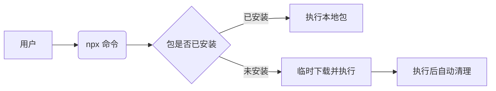

# NPX 深度解析：Node.js 的革命性包执行工具

NPX 是 Node.js 生态中一个强大的工具，它彻底改变了开发者安装和运行 JavaScript 包的方式。自 2017 年随 npm 5.2.0 发布以来，已成为现代开发流程中不可或缺的部分。

## 一、NPX 的本质

### 核心定位
NPX 不是包管理器，而是**包执行器**：


### 与传统方式的对比
| 场景               | 传统方式                     | NPX 方式                  |
|--------------------|----------------------------|--------------------------|
| 运行未安装的工具    | 先全局安装再运行            | 直接运行，自动处理        |
| 执行不同版本工具    | 需手动切换版本              | 指定版本号即可            |
| 避免全局污染       | 困难，需虚拟环境            | 默认隔离执行              |
| 一次性使用工具      | 安装/使用/卸载              | 单命令完成                |

## 二、核心工作原理

### 执行流程
1. **路径检查**：检查 `./node_modules/.bin` 和全局安装路径
2. **缓存检查**：查找 `~/.npm/_npx` 缓存
3. **临时安装**：未找到则从 npm 仓库下载到临时目录
4. **执行命令**：运行包的主执行文件
5. **自动清理**：删除临时文件（除非使用 `--no-clean`）

### 技术实现
```javascript
// 伪代码展示 npx 逻辑
async function npx(packageName, args) {
  const localPath = resolveLocal(packageName);
  if (localPath) return exec(localPath, args);
  
  const tempDir = createTempDir();
  await npm.install(packageName, tempDir);
  const binPath = findBinPath(tempDir);
  exec(binPath, args);
  cleanTempDir(tempDir); // 自动清理
}
```

## 三、核心应用场景

### 1. 运行脚手架工具
```bash
# 创建 React 应用（无需全局安装 create-react-app）
npx create-react-app my-app

# 创建 Vite 项目
npx create-vite@latest my-project
```

### 2. 执行项目本地命令
```bash
# 运行项目本地的 Webpack
npx webpack --config webpack.config.js

# 执行本地 TypeScript 编译器
npx tsc --version
```

### 3. 运行不同版本的工具
```bash
# 临时使用特定版本的 ESLint
npx eslint@7.32.0 src/

# 使用旧版 Create React App
npx create-react-app@4.0.0 legacy-app
```

### 4. 执行一次性工具
```bash
# 生成 SVG 雪碧图（无需安装）
npx svgo -f ./icons -o ./dist

# 检查包大小
npx package-size react@18 vue@3
```

### 5. 运行远程 gist 代码
```bash
# 直接执行 GitHub gist 中的脚本
npx https://gist.github.com/user/1234567890abcdef
```

## 四、高级用法技巧

### 1. 指定 Node.js 版本
```bash
# 使用特定 Node 版本运行脚本
npx -p node@14.21.3 node --version
```

### 2. 并行执行多个包
```bash
# 同时安装并运行多个工具
npx -p cowsay -p lolcatjs -c 'echo "Hello NPX" | cowsay | lolcatjs'
```

### 3. 永久缓存包
```bash
# 保留下载的包（避免重复下载）
npx --package=playwright@1.34.0 --yes -- playwright install
```

### 4. 在特定目录执行
```bash
# 在指定目录运行命令
npx --prefix ./client vite build
```

### 5. 安全执行限制
```bash
# 仅允许运行白名单中的包
npx --shell-mode --package=allowed-package
```

## 五、与类似工具对比

| 特性         | NPX       | Yarn dlx     | PNPM dlx    | Bunx        |
|--------------|-----------|--------------|-------------|-------------|
| 自动清理     | ✅         | ✅            | ✅           | ✅           |
| 多包支持     | ✅ (-p)    | ❌            | ❌           | ❌           |
| 版本锁定     | ✅ (@ver)  | ✅            | ✅           | ✅           |
| 远程脚本     | ✅ (URL)   | ❌            | ❌           | ❌           |
| 执行速度     | 中等       | 快           | 快          | 极快         |

## 六、企业级最佳实践

### 1. CI/CD 流水线优化
```yaml
# GitLab CI 示例
lint_job:
  script:
    - npx eslint "src/**/*.js"
    - npx stylelint "**/*.css"
```

### 2. 安全策略配置
```bash
# 禁止执行未经验证的包
npm config set ignore-scripts true
```

### 3. Monorepo 场景应用
```bash
# 在指定子包中运行命令
npx --prefix packages/client next build
```

### 4. 容器化部署
```Dockerfile
# Dockerfile 精简示例
FROM node:18-alpine
COPY package.json .
RUN npm install
COPY . .
CMD ["npx", "serve", "-s", "build"]
```

## 七、常见问题解决

### 1. 权限问题
```bash
# 修复 macOS/Linux 权限
mkdir ~/.npm/_npx
sudo chown -R $(whoami) ~/.npm
```

### 2. 缓存清理
```bash
# 清除 npx 缓存
npx clear-npx-cache
# 或手动删除
rm -rf ~/.npm/_npx
```

### 3. 版本冲突
```bash
# 强制使用最新版
npx --ignore-existing create-react-app@latest my-app
```

### 4. 网络问题
```bash
# 使用国内镜像源
npx --registry=https://registry.npmmirror.com create-react-app
```

## 八、性能数据统计

| 操作                 | 首次执行 | 后续执行 |
|----------------------|----------|----------|
| `npx create-react-app` | 25-40s   | 3-5s     |
| `npx eslint`          | 5-8s     | 0.3s     |
| `npx http-server`     | 3-5s     | 0.2s     |

> 测试环境：100Mbps 网络，SSD 存储，Node.js 18

## 九、未来演进

1. **与核心 npm 深度集成**：部分功能已合并到 `npm exec`
2. **安全增强**：计划引入包签名验证
3. **性能优化**：预加载常用工具包
4. **WebAssembly 支持**：跨语言工具执行

**最佳实践建议**：
- 在 `package.json` scripts 中使用本地路径而非全局命令
  ```json
  "scripts": {
    "build": "vite build",        // ❌ 依赖全局安装
    "build": "npx vite build"     // ✅ 安全可靠
  }
  ```
- 对于团队项目，优先使用本地依赖而非 npx
- 敏感环境使用 `--offline` 模式避免网络请求

NPX 通过其独特的临时执行模型，在开发者体验和系统整洁性之间取得了完美平衡，已成为现代 JavaScript 工具链中不可或缺的组成部分。